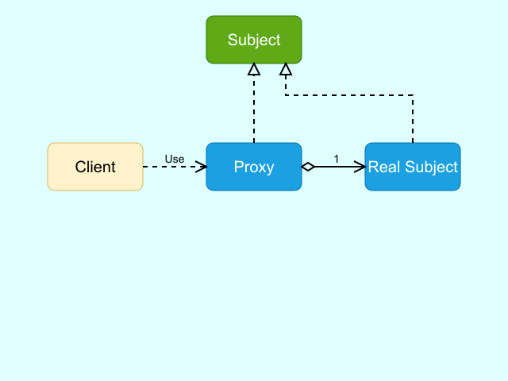
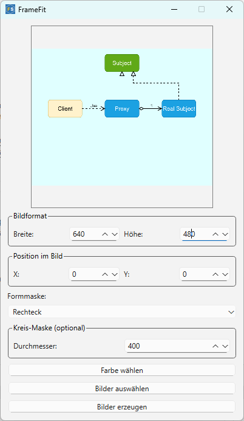
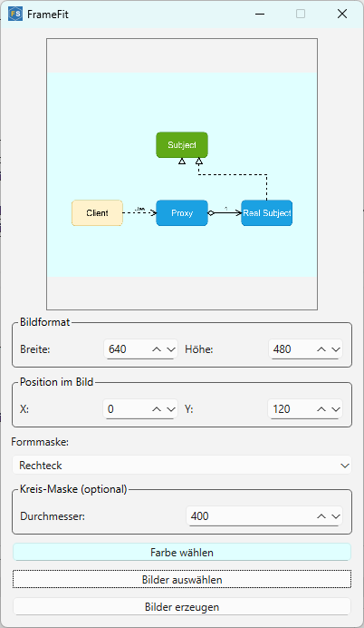
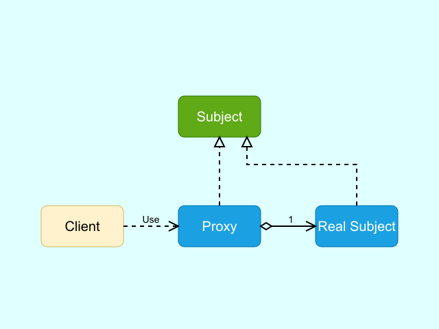
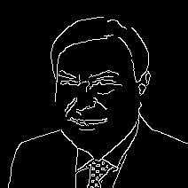
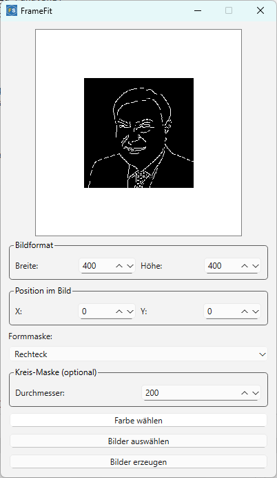
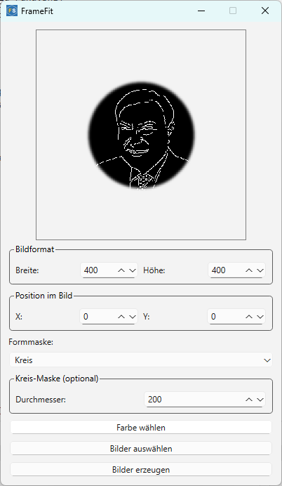
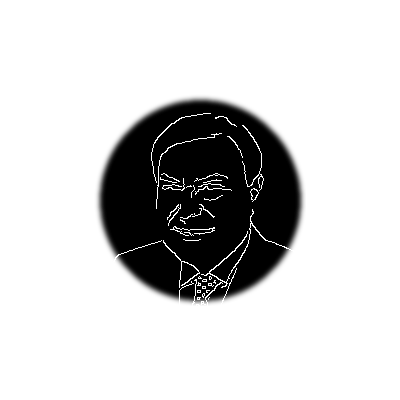

# FrameFit – Bildrahmen & Zuschnitt mit Maskierung


**FrameFit** ist ein einfach zu bedienendes Desktop-Tool auf Basis von **PyQt6**, mit dem Bilder in vorgegebene Rahmen eingepasst, verschoben, mit Hintergrundfarbe versehen und optional **kreisförmig maskiert** werden können – inklusive Vorschaufunktion, Drag-&-Drop-Unterstützung und Export in ein Zielverzeichnis.

## Zweck des Tools

Mit FrameFit kannst du:

- Profilbilder oder Logos zentriert in ein Rechteck oder einen Kreis einpassen
- den Hintergrund farblich anpassen
- das Bild interaktiv verschieben
- Vorschau mit Maske vor dem Speichern anzeigen
- Bilder lokal als PNG mit Maske speichern (für Web, Social Media, etc.)

## Features

| Funktion                    | Beschreibung                                                               |
|-----------------------------|----------------------------------------------------------------------------|
| Feste Bildgröße         | Breite und Höhe in Pixel frei einstellbar (0–1280)                         |
| Hintergrundfarbe         | frei wählbar per Dialog (wird auf „Farbe wählen“-Button sichtbar)          |
| Bildposition             | horizontale & vertikale Verschiebung einstellbar (-1280 bis +1280)         |
| Kreis-Maske              | optional aktivierbar, Durchmesser einstellbar, mit geglätteter Kante       |
| Maskenglättung        | Weiche Kanten durch `GaussianBlur(2.5)` bei Kreis-Maske               |
| Vorschau                 | zeigt Bild mit Hintergrund und Maske live                                 |
| Eingabebilder            | Auswahl per Dialog oder Drag & Drop aus dem Explorer                      |
| Export                   | Bilder werden in `./output_images/` gespeichert                          |
| Kompakt                  | GUI passt auf kleine Displays (400x700 px)                                |

## GUI-Bedienung

1. Wähle **Bildformat** (Breite/Höhe)
2. Aktiviere optional die **Kreis-Maske** (mit Durchmesser)
3. Wähle eine **Hintergrundfarbe**
4. Ziehe ein Bild in das Fenster oder nutze „Bilder auswählen“
5. Überprüfe die Vorschau
6. Klicke auf **„Bilder erzeugen“**, um die bearbeiteten Bilder zu speichern






## Unterstützte Formate

- **Eingabeformate:** PNG, JPG, JPEG  
- **Ausgabeformat:** PNG (mit Transparenz, wenn Kreis-Maske aktiv ist)

## Beispielanwendungen

Ideal für:

- Profilbilder (rund/zentriert)
- Produktbilder mit gleichmäßigem Rahmen
- Automatisierter Zuschnitt für Web-Komponenten
- Vorverarbeitung für ML-Projekte (normierte Bilder)






## Verzeichnisse

```text
FrameFit/
├── input_images/       ← Eingabebilder (optional, für Vorauswahl)
├── output_images/      ← Ergebnisbilder (automatisch erzeugt)
├── resources/
│   └── fs.ico          ← Programm-Icon
├── framefit.py         ← Hauptprogramm
├── requirements.txt    ← Python-Abhängigkeiten
└── README.md           ← Diese Datei
```

## Abhängigkeiten

Alle Abhängigkeiten sind Open Source:

```txt
PyQt6
Pillow
```

Installierbar über:

```bash
pip install -r requirements.txt
```

## Installation (virtuelle Umgebung empfohlen)

```bash
# 1. Repository klonen
git clone https://github.com/franzsteinkress/FrameFit.git
cd ./FrameFit

# 2. Virtuelle Umgebung erstellen
python -m venv .venv
.venv\\Scripts\\activate

# 3. Abhängigkeiten installieren
pip install -r requirements.txt
```

## Starten der Anwendung

```bash
python framefit.py
```

> Das Hauptfenster öffnet sich, und du kannst sofort mit der Bearbeitung beginnen.


## Lizenz & Hinweise

Dieses Projekt ist unter der [MIT-Lizenz](./LICENSE) veröffentlicht und wurde zu Demonstrations- und Lernzwecken im Bereich **lokaler Bildverarbeitung mit PyQt6** entwickelt. Inhalte und Code dürfen frei verwendet, modifiziert und verteilt werden.

## Kontakt / Support

Für Rückfragen oder Support:

* [Website](https://steinkress.com)
* [GitHub-Profil](https://github.com/franzsteinkress)
